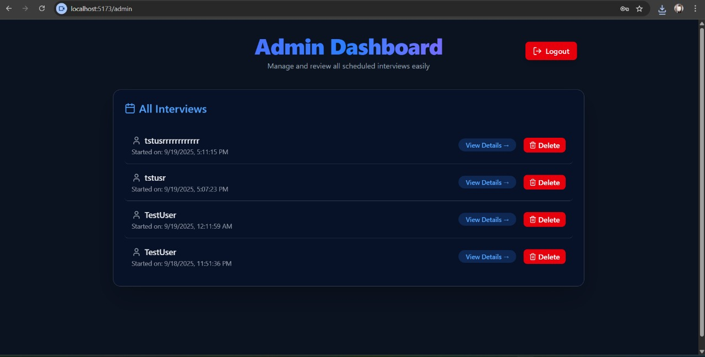
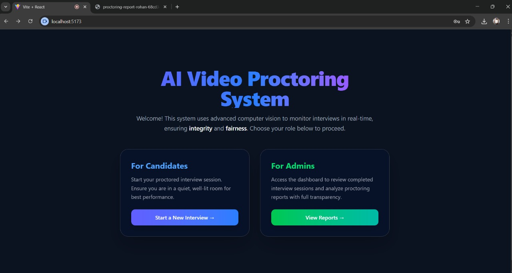
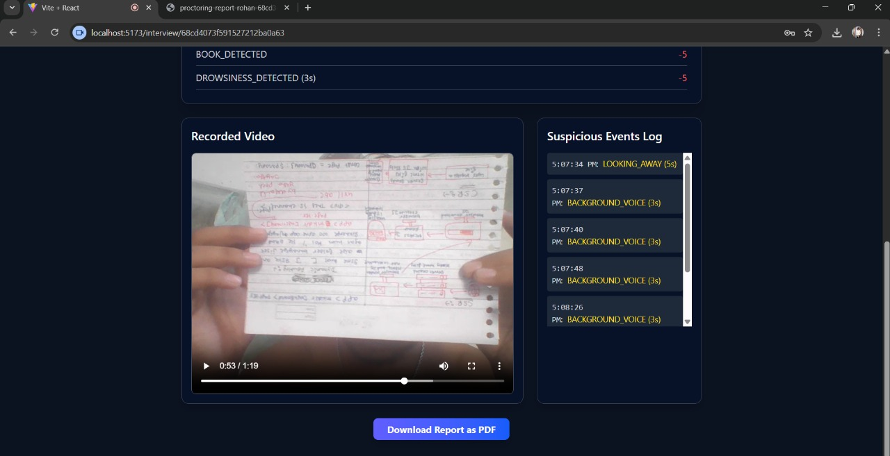
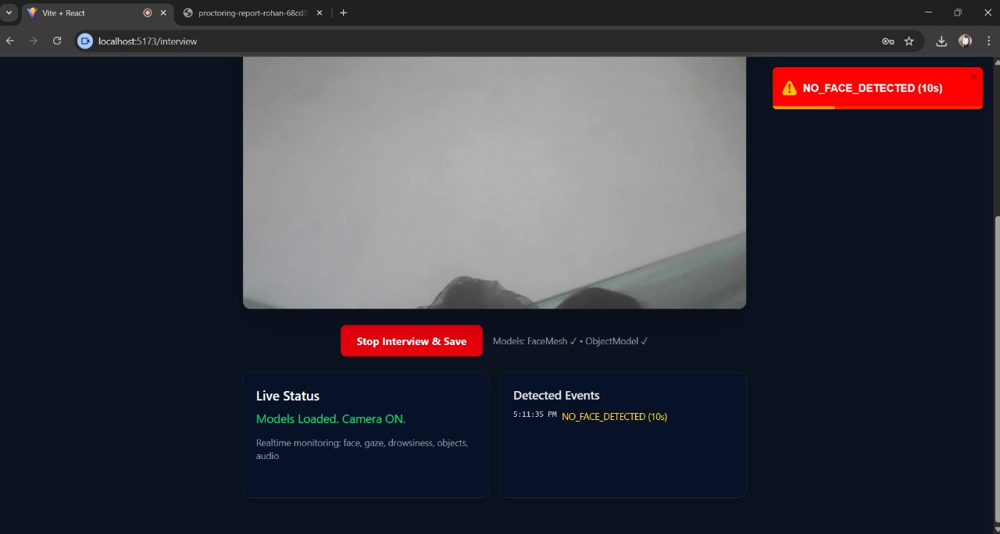
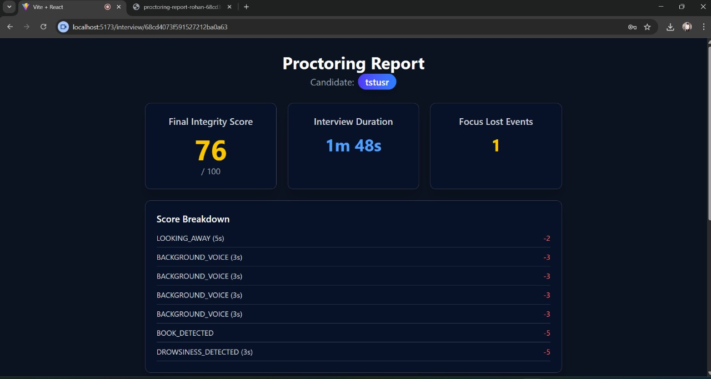
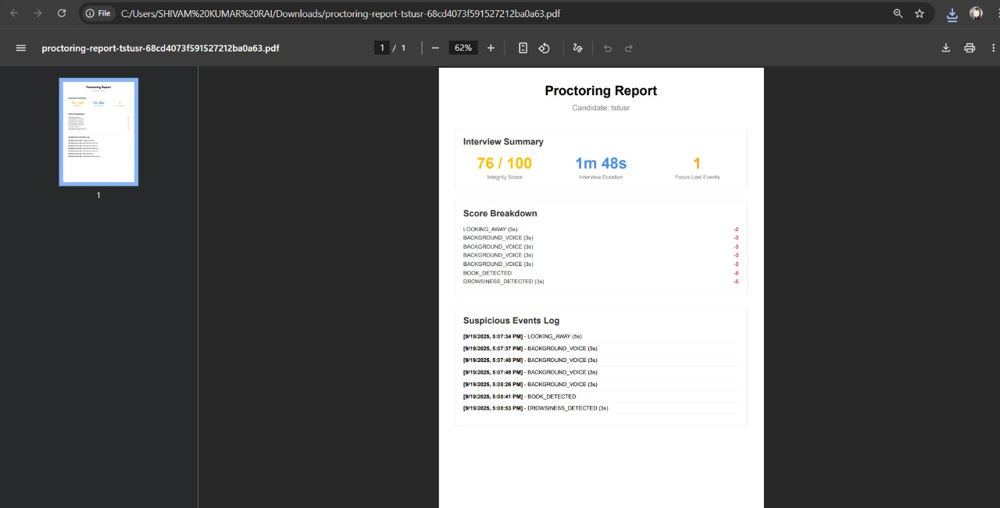

# 📌 AI Video Proctoring System

This project is an **AI-based Video Proctoring System** that ensures fairness and integrity during online interviews or exams. It uses **computer vision, audio monitoring, and real-time logging** to detect suspicious activities like multiple faces, looking away, background noise, and more.  

---
Project-Link: https://video-proctring.vercel.app/

## 📂 Project Structure
```
VideoProctoring/
│
├── Backend/               # Backend (Node.js + Express + MongoDB)
│   ├── config/            # Database connection (db.js)
│   ├── middlewares/       # Multer setup for file uploads
│   ├── models/            # Mongoose models (Interview, Log)
│   ├── routes/            # Express routes (logRoutes.js)
│   ├── cloudinary.js      # Cloudinary configuration
│   ├── app.js             # Express app configuration
│   ├── server.js          # Server entry point
│
├── Frontend/                # Frontend (React + Tailwind CSS)
│   ├── src/
│   │   ├── components/    # React components
│   │   │   ├── Admin.jsx
│   │   │   ├── AdminLogin.jsx
│   │   │   ├── HomePage.jsx
│   │   │   ├── Interview.jsx
│   │   │   ├── InterviewDetail.jsx
│   │   │   ├── ReportDocument.jsx
│   │   └── App.jsx
│   └── package.json
│
├── .env                   # Environment variables
├── README.md              # Documentation
```

---

## 🛠️ Tech Stack

### **Frontend**
- React.js
- Tailwind CSS
- React Router DOM
- Axios
- TensorFlow.js + Mediapipe (FaceMesh, Object Detection)
- React Toastify (Notifications)

### **Backend**
- Node.js
- Express.js
- MongoDB + Mongoose
- Multer (for file upload)
- Cloudinary (for video storage)

---

## ⚙️ Installation

### 1️⃣ Clone the repository
```bash
git clone https://github.com/rohanmaan07/Video_Proctoring_System
```

### 2️⃣ Setup Backend
```bash
cd Backend
npm install
```

Create a `.env` file inside `server/`:
```env
PORT=5000
MONGO_URI=your_mongodb_connection_string
CLOUDINARY_CLOUD_NAME=your_cloudinary_name
CLOUDINARY_API_KEY=your_cloudinary_api_key
CLOUDINARY_API_SECRET=your_cloudinary_api_secret
```

Start backend:
```bash
node server.js
```

---

### 3️⃣ Setup Frontend
```bash
cd frontend
npm install
npm run dev
```

---

## 🚀 Features

✅ **Candidate Side**
- Start interview with camera + mic access  
- AI detects:
  - Multiple faces
  - Looking away
  - No face detection
  - Drowsiness
  - Phone/Book/Object detection
  - Background noise  
- Real-time alerts + logging  
- Automatic video recording & Cloud upload  

✅ **Admin Side**
- Secure login  
- Dashboard showing all interviews  
- View candidate activity logs & video  
- Integrity Score (100 → deductions based on violations)  
- Delete interviews if needed  

---

## 📡 API Endpoints

### Base URL: `/api`

| Method | Endpoint               | Description |
|--------|------------------------|-------------|
| POST   | `/interview/start`     | Start a new interview |
| POST   | `/log`                 | Log an event |
| POST   | `/upload-video`        | Upload recorded video to Cloudinary |
| GET    | `/interviews`          | Get all interviews (Admin) |
| GET    | `/interview/:id`       | Get interview details with logs |
| DELETE | `/interview/:id`       | Delete interview (Admin) |

---

## 📊 Integrity Score Calculation

- **Phone Detected** → -7  
- **Book Detected** → -5  
- **Looking Away** → -2  
- **No Face** → -5  
- **Multiple Faces** → -10  
- **Drowsiness** → -5  
- **Background Voice** → -3  
- **Extra Device** → -8  

👉 Final score never goes below **0**.  

---

## 🔐 Admin Access
Default admin password is set inside `AdminLogin.jsx`:
```js
const adminPassword = "9711657307--message me for the password";
```
---

## 🎥 Demo Workflow

1. Candidate enters name → Starts Interview  
2. Camera + Mic activate → Models load  
3. AI detects suspicious behavior → Logs events in backend  
4. Recording stored in Cloudinary  
5. Admin logs in → Views interviews + reports  

---

## 🚀 Future Improvements
- JWT-based secure authentication for Admin  
- Live monitoring with WebSocket  
- AI-based voice recognition for background speech  
- More advanced scoring system  

---

### 🖼️ Project Screenshots

- **Admin Dashboard:** 
- **Homepage:** 
- **Interview Details:** 
- **Interview View:** 
- **Proctoring Report:** 
- **PDF Report:** 
